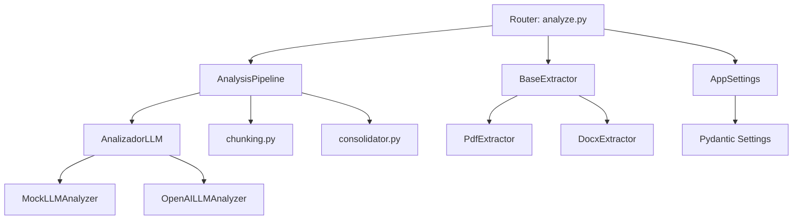
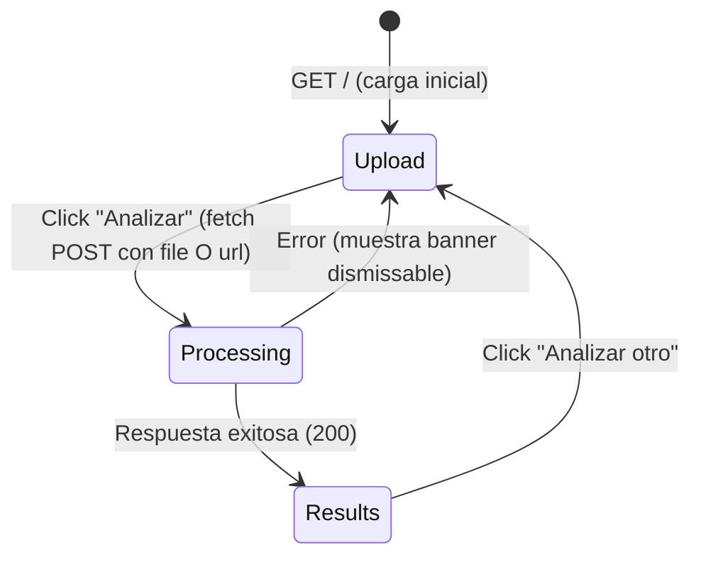

# Design Document: Lector de Términos y Condiciones con IA

## Overview

Este documento describe el diseño técnico de la aplicación web "Lector de Términos y Condiciones con IA". La aplicación permite a usuarios subir documentos PDF o Word conteniendo términos y condiciones, extrae su texto, lo envía a un LLM para análisis, y presenta un resumen estructurado con cláusulas de riesgo categorizadas por severidad.

### Principios de diseño

- **Stateless**: Sin persistencia de datos, cada request es independiente
- **Modular**: Componentes desacoplados mediante interfaces abstractas (Strategy pattern)
- **Configurable**: Todo parámetro operativo configurable vía variables de entorno
- **Seguro**: Sin almacenamiento de documentos, limpieza en memoria post-análisis
- **Simple**: Frontend renderizado con Jinja2, JavaScript nativo para UX

### Stack tecnológico

| Capa | Tecnología |
|------|-----------|
| Backend | Python 3.11+, FastAPI |
| Validación | Pydantic v2 |
| Templates | Jinja2 |
| Frontend | HTML5, CSS3, JavaScript nativo |
| PDF | pypdf |
| Word | python-docx |
| Config | Pydantic Settings + .env |
| Testing | pytest, pytest-asyncio, hypothesis |

## Architecture

### Diagrama de arquitectura de alto nivel

```
┌─────────────────────────────────────────────────────────────────┐
│                        CLIENTE (Navegador)                       │
│  ┌──────────┐    ┌──────────────┐    ┌───────────────────────┐  │
│  │  Upload  │───▶│  Processing  │───▶│      Results          │  │
│  │  Screen  │    │  Indicator   │    │  (Summary + Risks)    │  │
│  └──────────┘    └──────────────┘    └───────────────────────┘  │
│         │              ▲                        ▲                │
│         │   fetch()    │         fetch()        │                │
└─────────┼──────────────┼────────────────────────┼────────────────┘
          │              │                        │
          ▼              │                        │
┌─────────────────────────────────────────────────────────────────┐
│                     FastAPI Backend                              │
│                                                                 │
│  ┌────────────┐    ┌────────────────┐    ┌─────────────────┐   │
│  │  Router    │───▶│   Service      │───▶│  Analizador_LLM │   │
│  │  /api/v1/  │    │  (Pipeline)    │    │  (Strategy)     │   │
│  └────────────┘    └────────────────┘    └─────────────────┘   │
│        │                  │                       │             │
│        ▼                  ▼                       ▼             │
│  ┌────────────┐    ┌────────────────┐    ┌─────────────────┐   │
│  │ Validators │    │  Extractors    │    │  LLM Provider   │   │
│  │ (Pydantic) │    │  (PDF/DOCX)    │    │  (Mock/OpenAI)  │   │
│  └────────────┘    └────────────────┘    └─────────────────┘   │
└─────────────────────────────────────────────────────────────────┘
```

### Flujo de datos principal

```
Usuario sube archivo
        │
        ▼
┌─────────────────┐
│ Validar formato │──── Extensión inválida ──▶ HTTP 400
│ y tamaño        │──── Tamaño excedido ────▶ HTTP 400
└────────┬────────┘
         │ Válido
         ▼
┌─────────────────┐
│ Extraer texto   │──── Archivo corrupto ───▶ HTTP 400
│ (PDF/DOCX)      │──── < 100 chars (PDF) ─▶ HTTP 400 (escaneado)
└────────┬────────┘
         │ Texto extraído
         ▼
┌─────────────────┐
│ Validar longitud│──── > 20,000 palabras ──▶ HTTP 400
└────────┬────────┘
         │ Dentro del límite
         ▼
┌─────────────────┐
│ ¿> 12,000 chars?│
└────┬───────┬────┘
     │ Sí    │ No
     ▼       ▼
┌────────┐ ┌────────────┐
│Chunking│ │Análisis    │
│+ Map-  │ │directo     │
│Reduce  │ │(1 llamada) │
└───┬────┘ └─────┬──────┘
    │             │
    └──────┬──────┘
           ▼
┌─────────────────┐
│ Validar resultado│──── No 5 puntos ──▶ Reintentar (1 vez)
│ (5 summary pts) │──── 2do fallo ────▶ HTTP 500
└────────┬────────┘
         │ Válido
         ▼
┌─────────────────┐
│ Retornar JSON   │
│ AnalysisResult  │
└────────┬────────┘
         │
         ▼
  Limpiar memoria
```

## Components and Interfaces

### Estructura de directorios

```
app/
├── __init__.py
├── main.py                    # Punto de entrada FastAPI, lifespan
├── core/
│   ├── __init__.py
│   ├── config.py              # Pydantic Settings (AppSettings)
│   └── exceptions.py          # Excepciones personalizadas
├── extractors/
│   ├── __init__.py
│   ├── base.py                # BaseExtractor (abc.ABC)
│   ├── pdf_extractor.py       # PdfExtractor (pypdf)
│   └── docx_extractor.py      # DocxExtractor (python-docx)
├── llm/
│   ├── __init__.py
│   ├── base.py                # AnalizadorLLM (abc.ABC)
│   ├── mock_provider.py       # MockLLMAnalyzer
│   └── openai_provider.py     # OpenAILLMAnalyzer
├── services/
│   ├── __init__.py
│   ├── chunking.py            # Lógica de división por párrafos
│   ├── analysis_pipeline.py   # Orquestador Map-Reduce + análisis directo
│   └── consolidator.py        # Reducción de resultados parciales
├── schemas/
│   ├── __init__.py
│   └── analysis.py            # RiskClause, AnalysisResult, ErrorResponse
├── routers/
│   ├── __init__.py
│   └── analyze.py             # POST /api/v1/analyze
├── templates/
│   └── index.html             # Template Jinja2 principal
└── static/
    ├── css/
    │   └── styles.css          # Estilos (severidad, layout, disclaimer)
    └── js/
        └── app.js              # Lógica de estados y fetch API
```

### Componente: Extractors

Implementación del patrón Template Method para extracción de texto.

```python
# app/extractors/base.py
from abc import ABC, abstractmethod

class BaseExtractor(ABC):
    """Clase base abstracta para extractores de texto."""

    @abstractmethod
    def extract(self, file_content: bytes) -> str:
        """Extrae texto plano del contenido binario del archivo.
        
        Args:
            file_content: Contenido binario del archivo subido.
            
        Returns:
            Texto plano extraído del documento.
            
        Raises:
            ExtractionError: Si el archivo es corrupto o ilegible.
            ScannedDocumentException: Si el PDF no contiene texto extraíble.
        """
        ...
```

**Decisión de diseño**: Se usa `bytes` como entrada (no rutas de archivo) porque el sistema es stateless y no persiste archivos en disco. El contenido se mantiene en memoria solo durante el procesamiento del request.

*Valida: Requirements 2.1, 2.2, 2.3, 2.4*

### Componente: LLM Interface (Strategy Pattern)

```python
# app/llm/base.py
from abc import ABC, abstractmethod
from app.schemas.analysis import AnalysisResult

class AnalizadorLLM(ABC):
    """Interfaz abstracta para proveedores de análisis LLM.
    
    Implementa el patrón Strategy para permitir intercambio
    de proveedores sin modificar la lógica de negocio.
    """

    @abstractmethod
    async def analyze(self, text: str) -> AnalysisResult:
        """Analiza texto de términos y condiciones.
        
        Args:
            text: Texto plano a analizar (fragmento o documento completo).
            
        Returns:
            AnalysisResult con resumen y cláusulas de riesgo.
            
        Raises:
            LLMTimeoutError: Si la llamada excede el timeout configurado.
            LLMCommunicationError: Si hay error de red/API.
        """
        ...
```

**Selección de proveedor** (factory function):

```python
# app/llm/__init__.py
from app.core.config import get_settings

def get_llm_analyzer() -> AnalizadorLLM:
    settings = get_settings()
    if settings.llm_provider == "mock":
        from app.llm.mock_provider import MockLLMAnalyzer
        return MockLLMAnalyzer()
    elif settings.llm_provider == "openai":
        from app.llm.openai_provider import OpenAILLMAnalyzer
        return OpenAILLMAnalyzer(api_key=settings.llm_api_key)
    else:
        raise ValueError(f"Proveedor LLM no soportado: {settings.llm_provider}")
```

*Valida: Requirements 8.1, 8.2, 8.3, 8.4*

### Componente: Chunking Service

```python
# app/services/chunking.py
from app.core.config import get_settings

def chunk_text(text: str) -> list[str]:
    """Divide texto en fragmentos por párrafos.
    
    Estrategia:
    1. Dividir por doble salto de línea (párrafos)
    2. Agrupar párrafos hasta alcanzar el umbral de chunk
    3. Cada chunk mantiene párrafos completos (no corta a mitad)
    
    Args:
        text: Texto completo extraído (> 12,000 caracteres).
        
    Returns:
        Lista de fragmentos, cada uno <= umbral de chunking.
    """
    ...
```

**Invariante clave**: La concatenación de todos los chunks (con separador de párrafo) debe producir el texto original. No se pierde contenido durante el chunking.

*Valida: Requirements 3.1*

### Componente: Analysis Pipeline

```python
# app/services/analysis_pipeline.py
from app.schemas.analysis import AnalysisResult
from app.llm.base import AnalizadorLLM

class AnalysisPipeline:
    """Orquestador del análisis de documentos.
    
    Decide entre análisis directo (textos cortos) y Map-Reduce
    (textos largos). Maneja reintentos y validación de resultados.
    """

    def __init__(self, analyzer: AnalizadorLLM):
        self.analyzer = analyzer

    async def analyze_document(self, text: str) -> AnalysisResult:
        """Pipeline completo de análisis.
        
        1. Evalúa longitud del texto
        2. Si > umbral: chunk → map (análisis paralelo) → reduce
        3. Si <= umbral: análisis directo
        4. Valida resultado (5 summary_points)
        5. Reintenta una vez si validación falla
        
        Raises:
            AnalysisValidationError: Si después de 2 intentos no hay 5 puntos.
            LLMTimeoutError: Si alguna llamada excede el timeout.
        """
        ...
```

**Lógica de reintento**:
- Primer intento: llamada normal al LLM
- Si el resultado no tiene exactamente 5 `summary_points`: reintento con el mismo texto
- Si el segundo intento también falla: log del error + excepción `AnalysisValidationError`

*Valida: Requirements 3.2, 3.3, 3.4, 4.1, 4.4, 4.5*

### Componente: Consolidator (Reduce)

```python
# app/services/consolidator.py
from app.schemas.analysis import AnalysisResult, RiskClause

def consolidate_results(partial_results: list[AnalysisResult]) -> AnalysisResult:
    """Consolida múltiples resultados parciales en uno final.
    
    Estrategia:
    1. Recopilar todas las risk_clauses de todos los fragmentos
    2. Deduplicar cláusulas por similitud de título (normalizado)
    3. Seleccionar los 5 puntos de resumen más representativos
    4. Determinar is_valid_terms por mayoría de fragmentos
    
    Args:
        partial_results: Lista de AnalysisResult de cada chunk.
        
    Returns:
        AnalysisResult unificado y deduplicado.
    """
    ...
```

**Criterio de deduplicación**: Dos `RiskClause` se consideran equivalentes si sus títulos normalizados (lowercase, stripped) tienen similitud > 80% o si sus `quote` son idénticas.

*Valida: Requirements 3.3*

### Componente: Router (API Layer)

```python
# app/routers/analyze.py
from fastapi import APIRouter, UploadFile, File, HTTPException
from app.schemas.analysis import AnalysisResult

router = APIRouter(prefix="/api/v1", tags=["analysis"])

@router.post("/analyze", response_model=AnalysisResult)
async def analyze_document(file: UploadFile = File(...)) -> AnalysisResult:
    """Endpoint principal de análisis.
    
    Flujo:
    1. Validar extensión (.pdf, .docx)
    2. Validar tamaño (≤ MAX_FILE_SIZE)
    3. Leer contenido en memoria
    4. Extraer texto (seleccionar extractor por extensión)
    5. Validar longitud de texto (≤ MAX_WORDS)
    6. Ejecutar pipeline de análisis
    7. Retornar AnalysisResult como JSON
    8. Limpiar referencias en memoria (finally)
    
    Error codes:
    - 400: Validación fallida (formato, tamaño, escaneado, longitud)
    - 500: Error interno (LLM timeout, validación fallida tras reintento)
    """
    ...
```

*Valida: Requirements 10.1, 10.2, 10.3, 1.1-1.4*

## Data Models

### Esquemas Pydantic

```python
# app/schemas/analysis.py
from enum import Enum
from typing import Optional
from pydantic import BaseModel, field_validator

class Severity(str, Enum):
    HIGH = "HIGH"
    MEDIUM = "MEDIUM"
    LOW = "LOW"

class RiskClause(BaseModel):
    """Cláusula identificada como riesgosa o sospechosa."""
    title: str
    severity: Severity
    explanation: str
    quote: Optional[str] = None

class AnalysisResult(BaseModel):
    """Resultado completo del análisis de un documento TyC."""
    is_valid_terms: bool
    summary_points: list[str]
    risk_clauses: list[RiskClause]
    rejection_reason: Optional[str] = None

    @field_validator("summary_points")
    @classmethod
    def validate_summary_points_count(cls, v: list[str]) -> list[str]:
        if len(v) != 5:
            raise ValueError(
                f"summary_points debe contener exactamente 5 elementos, recibió {len(v)}"
            )
        return v
```

*Valida: Requirements 11.1, 11.2, 11.3, 11.4*

### Esquema de respuesta de error

```python
# app/schemas/analysis.py (continuación)
class ErrorResponse(BaseModel):
    """Respuesta de error estandarizada."""
    detail: str
    error_code: str

# Códigos de error definidos:
# INVALID_FORMAT: Formato de archivo no soportado
# FILE_TOO_LARGE: Archivo excede tamaño máximo
# SCANNED_DOCUMENT: PDF sin texto extraíble
# CORRUPT_FILE: Archivo corrupto o ilegible
# TEXT_TOO_LONG: Texto excede límite de palabras
# NOT_TERMS: Contenido no es TyC
# LLM_TIMEOUT: Timeout de comunicación con LLM
# ANALYSIS_FAILED: Análisis no pudo completarse (reintento fallido)
```

*Valida: Requirements 12.1-12.6*

### Modelo de configuración

```python
# app/core/config.py
from pydantic_settings import BaseSettings
from functools import lru_cache

class AppSettings(BaseSettings):
    """Configuración de la aplicación cargada desde variables de entorno."""
    
    # LLM
    llm_provider: str = "mock"
    llm_api_key: str = ""
    llm_timeout_seconds: int = 30
    
    # Límites de archivo
    max_file_size_mb: int = 10
    max_words: int = 20_000
    
    # Chunking
    chunking_threshold: int = 12_000
    
    # Aplicación
    app_name: str = "Lector de Términos y Condiciones con IA"
    debug: bool = False

    class Config:
        env_file = ".env"
        env_file_encoding = "utf-8"

    @property
    def max_file_size_bytes(self) -> int:
        return self.max_file_size_mb * 1024 * 1024

@lru_cache
def get_settings() -> AppSettings:
    return AppSettings()
```

*Valida: Requirements 9.1, 9.3, 9.4*

### Excepciones personalizadas

```python
# app/core/exceptions.py

class AppBaseException(Exception):
    """Excepción base de la aplicación."""
    def __init__(self, message: str, error_code: str):
        self.message = message
        self.error_code = error_code
        super().__init__(message)

class InvalidFormatException(AppBaseException):
    def __init__(self):
        super().__init__(
            message="Solo se aceptan archivos en formato PDF (.pdf) y Word (.docx).",
            error_code="INVALID_FORMAT"
        )

class FileTooLargeException(AppBaseException):
    def __init__(self, max_size_mb: int):
        super().__init__(
            message=f"El archivo excede el tamaño máximo permitido de {max_size_mb} MB.",
            error_code="FILE_TOO_LARGE"
        )

class ScannedDocumentException(AppBaseException):
    def __init__(self):
        super().__init__(
            message="El documento parece ser escaneado (imagen). Esta versión solo procesa documentos con texto seleccionable.",
            error_code="SCANNED_DOCUMENT"
        )

class ExtractionError(AppBaseException):
    def __init__(self):
        super().__init__(
            message="No se pudo leer el archivo. Verifique que no esté corrupto.",
            error_code="CORRUPT_FILE"
        )

class TextTooLongException(AppBaseException):
    def __init__(self, max_words: int):
        super().__init__(
            message=f"El contenido del documento excede la capacidad de análisis ({max_words:,} palabras máximo).",
            error_code="TEXT_TOO_LONG"
        )

class LLMTimeoutError(AppBaseException):
    def __init__(self):
        super().__init__(
            message="El servicio de análisis no respondió a tiempo. Intente nuevamente.",
            error_code="LLM_TIMEOUT"
        )

class LLMCommunicationError(AppBaseException):
    def __init__(self):
        super().__init__(
            message="El servicio de análisis no está disponible temporalmente. Intente más tarde.",
            error_code="LLM_COMMUNICATION_ERROR"
        )

class AnalysisValidationError(AppBaseException):
    def __init__(self):
        super().__init__(
            message="El análisis no pudo completarse correctamente. Intente nuevamente.",
            error_code="ANALYSIS_FAILED"
        )

class NotTermsException(AppBaseException):
    def __init__(self):
        super().__init__(
            message="El contenido del documento no corresponde a términos y condiciones.",
            error_code="NOT_TERMS"
        )
```

### Diagrama de dependencias entre componentes



## Correctness Properties

*A property is a characteristic or behavior that should hold true across all valid executions of a system — essentially, a formal statement about what the system should do. Properties serve as the bridge between human-readable specifications and machine-verifiable correctness guarantees.*

### Property 1: Validación de extensión acepta solo formatos permitidos

*For any* nombre de archivo, el sistema acepta el archivo si y solo si su extensión (case-insensitive) es `.pdf` o `.docx`. Archivos con cualquier otra extensión son rechazados.

**Validates: Requirements 1.1, 1.2**

### Property 2: Validación de tamaño rechaza archivos que exceden el límite

*For any* archivo con tamaño mayor al máximo configurado, el sistema rechaza el archivo con error apropiado. Para cualquier archivo con tamaño menor o igual al máximo, el sistema no rechaza por tamaño.

**Validates: Requirements 1.3**

### Property 3: Detección de documento escaneado por umbral de caracteres

*For any* texto extraído de un PDF con menos de 100 caracteres, el sistema lanza `ScannedDocumentException`. Para cualquier texto con 100 o más caracteres, no se lanza dicha excepción.

**Validates: Requirements 2.3**

### Property 4: Validación de longitud de texto rechaza documentos extensos

*For any* texto extraído cuyo conteo de palabras excede el máximo configurado, el sistema rechaza el documento. Para cualquier texto dentro del límite, el sistema no rechaza por longitud.

**Validates: Requirements 2.5**

### Property 5: Chunking preserva contenido completo (invariante)

*For any* texto con más de 12,000 caracteres que contiene párrafos separados por doble salto de línea, la concatenación de todos los chunks producidos (con el separador apropiado) es igual al texto original. No se pierde ni se agrega contenido durante el chunking.

**Validates: Requirements 3.1**

### Property 6: Consolidación elimina cláusulas duplicadas

*For any* lista de `AnalysisResult` parciales que contienen `RiskClause` con títulos duplicados (normalización lowercase + strip), el resultado consolidado contiene cada cláusula única exactamente una vez. El número de cláusulas en el resultado consolidado es menor o igual a la suma de cláusulas de todos los parciales.

**Validates: Requirements 3.3**

### Property 7: Validación de AnalysisResult rechaza listas sin 5 elementos

*For any* lista de strings con longitud diferente de 5, la creación de un `AnalysisResult` con dicha lista como `summary_points` produce un `ValidationError`. Para cualquier lista con exactamente 5 strings, la validación es exitosa.

**Validates: Requirements 11.3**

### Property 8: Serialización round-trip de AnalysisResult

*For any* instancia válida de `AnalysisResult`, serializar a JSON y luego deserializar produce un objeto equivalente al original (todos los campos preservados).

**Validates: Requirements 11.4**

### Property 9: Archivos inválidos en endpoint retornan HTTP 400

*For any* archivo con extensión no soportada o tamaño excedido enviado a `POST /api/v1/analyze`, el sistema retorna código HTTP 400 con mensaje descriptivo en español.

**Validates: Requirements 10.3**

## Error Handling

### Estrategia general

El sistema utiliza un handler global de excepciones en FastAPI que convierte excepciones tipadas en respuestas HTTP apropiadas.

```python
# app/main.py (fragmento)
from fastapi import FastAPI, Request
from fastapi.responses import JSONResponse
from app.core.exceptions import AppBaseException

app = FastAPI()

@app.exception_handler(AppBaseException)
async def app_exception_handler(request: Request, exc: AppBaseException):
    status_code = 400 if exc.error_code != "ANALYSIS_FAILED" else 500
    # LLM_TIMEOUT y LLM_COMMUNICATION_ERROR también son 500
    if exc.error_code in ("LLM_TIMEOUT", "LLM_COMMUNICATION_ERROR", "ANALYSIS_FAILED"):
        status_code = 500
    return JSONResponse(
        status_code=status_code,
        content={"detail": exc.message, "error_code": exc.error_code}
    )
```

### Mapa de errores

| Excepción | HTTP Code | error_code | Causa |
|-----------|-----------|------------|-------|
| InvalidFormatException | 400 | INVALID_FORMAT | Extensión no es .pdf/.docx |
| FileTooLargeException | 400 | FILE_TOO_LARGE | Archivo > MAX_FILE_SIZE |
| ScannedDocumentException | 400 | SCANNED_DOCUMENT | PDF con < 100 chars de texto |
| ExtractionError | 400 | CORRUPT_FILE | Archivo corrupto/ilegible |
| TextTooLongException | 400 | TEXT_TOO_LONG | Texto > MAX_WORDS |
| NotTermsException | 400 | NOT_TERMS | No es documento de TyC |
| LLMTimeoutError | 500 | LLM_TIMEOUT | Timeout en llamada al LLM |
| LLMCommunicationError | 500 | LLM_COMMUNICATION_ERROR | Error de red con LLM |
| AnalysisValidationError | 500 | ANALYSIS_FAILED | 2 intentos sin 5 summary_points |

### Lógica de reintento

```
Primer intento de análisis
    │
    ├── Resultado válido (5 puntos) ──▶ Retornar resultado
    │
    └── Resultado inválido (!= 5 puntos)
            │
            ▼
        Segundo intento
            │
            ├── Resultado válido ──▶ Retornar resultado
            │
            └── Resultado inválido
                    │
                    ▼
                Log error + raise AnalysisValidationError
```

### Timeout handling

- Cada llamada al LLM tiene un timeout configurado (default 30s)
- Se usa `asyncio.wait_for()` para enforcar el timeout
- En Map-Reduce, cada chunk tiene su propio timeout independiente
- Si un chunk falla por timeout, toda la operación se cancela

*Valida: Requirements 4.3, 4.4, 4.5, 12.1-12.6*

## Frontend Design

### Sistema de diseño

La interfaz sigue un estilo SaaS moderno inspirado en Vercel/Linear, con tipografía Inter, glassmorphism y micro-interacciones.

**Tipografía:** Inter (Google Fonts), pesos 400/500/600/700, letter-spacing ajustado para títulos.

**Paleta de colores (Light mode):**
- Background: `#f9fafb` (gris neutro limpio)
- Surface/Cards: `#ffffff` con `box-shadow` sutil
- Primary: `#2563eb` (azul profesional)
- Text: `#111827` / Secondary: `#6b7280`
- Severidad: High `#ef4444`, Medium `#f59e0b`, Low `#10b981`

**Paleta de colores (Dark mode)** via `[data-theme="dark"]`:
- Background: `#0a0f1a` (azul oscuro profundo)
- Surface: `#111827`, Elevated: `#1f2937`
- Primary: `#60a5fa`
- Text: `#f3f4f6` / Secondary: `#9ca3af`
- Severidad con colores claros para contraste sobre fondo oscuro

**Efectos visuales:**
- Glassmorphism: `backdrop-filter: blur(8px)` en tarjetas de riesgo
- Transiciones: `transition: all 0.2s ease` en elementos interactivos
- Hover lift: `transform: translateY(-1px)` + shadow progression
- Animaciones de entrada: `fadeIn` (opacity + translateY) en transiciones de estado
- Drag-over: `scale(1.01)` + ring outline `box-shadow: 0 0 0 4px rgba(...)`

### Estados de la interfaz

3 estados gestionados con JavaScript nativo (IIFE pattern, sin frameworks):

**Estado 1: UPLOAD** — Pantalla principal con:
- Header: badge de versión + título + toggle dark mode (SVG sol/luna)
- Disclaimer legal (ícono SVG info-circle, fondo azul suave)
- Aviso de privacidad (ícono SVG candado, fondo verde suave)
- Tabs: "Subir archivo" | "Ingresar URL" (pill-style selector)
- Panel archivo: Zona drag-and-drop con íconos SVG, badges de formato (.PDF, .DOCX, .TXT), micro-animaciones
- Panel URL: Campo de texto con ícono globe, placeholder descriptivo
- Botón "Analizar documento" con ícono SVG

**Estado 2: PROCESSING** — Indicador de progreso con:
- Spinner CSS animado (border-top rotation)
- Texto "Analizando documento..."
- Pasos del proceso como badges (Extrayendo texto → Analizando cláusulas → Generando resumen)

**Estado 3: RESULTS** — Grid 2 columnas (main + sidebar):
- Main: Resumen (5 puntos como lista numerada con cards) + Cláusulas de riesgo (cards con border-left por severidad, badges SVG, glassmorphism)
- Sidebar: Disclaimer compacto + leyenda de severidad
- Botón "Analizar otro documento"

### Transiciones de estado



### Input dual (File / URL)

El endpoint acepta dos modos de entrada via tabs en el frontend:
- **Modo archivo**: FormData con campo `file` (PDF, DOCX, TXT)
- **Modo URL**: FormData con campo `url` (string http/https)

El JS envía solo el campo activo según la tab seleccionada.

### Dark Mode

- Toggle persiste en `localStorage`
- Respeta `prefers-color-scheme` del sistema al primer acceso
- Variables CSS se redefinen completamente bajo `[data-theme="dark"]`
- Transición suave de 0.3s en background-color y color del body

*Valida: Requirements 5.1-5.6, 6.1-6.4, 13.1-13.8, 14.3*

## Configuration Management

### Variables de entorno

| Variable | Tipo | Default | Descripción |
|----------|------|---------|-------------|
| `LLM_PROVIDER` | str | "mock" | Proveedor LLM: "mock", "openai" |
| `LLM_API_KEY` | str | "" | API key del proveedor LLM |
| `LLM_TIMEOUT_SECONDS` | int | 30 | Timeout por llamada al LLM (segundos) |
| `MAX_FILE_SIZE_MB` | int | 10 | Tamaño máximo de archivo (MB) |
| `MAX_WORDS` | int | 20000 | Máximo de palabras en texto extraído |
| `CHUNKING_THRESHOLD` | int | 12000 | Umbral de caracteres para activar chunking |
| `DEBUG` | bool | False | Modo debug (logs detallados) |

### Validación al arranque

Al iniciar la aplicación, `AppSettings` valida que:
1. Si `LLM_PROVIDER` != "mock", entonces `LLM_API_KEY` debe tener valor no vacío
2. `MAX_FILE_SIZE_MB` > 0
3. `MAX_WORDS` > 0
4. `CHUNKING_THRESHOLD` > 0
5. `LLM_TIMEOUT_SECONDS` > 0

Si alguna validación falla, la aplicación no arranca y muestra un mensaje descriptivo indicando qué variable tiene un valor inválido o falta.

```python
# Validación condicional en AppSettings
from pydantic import model_validator

class AppSettings(BaseSettings):
    ...
    
    @model_validator(mode="after")
    def validate_llm_config(self) -> "AppSettings":
        if self.llm_provider != "mock" and not self.llm_api_key:
            raise ValueError(
                f"LLM_API_KEY es requerida cuando LLM_PROVIDER='{self.llm_provider}'"
            )
        return self
```

### Archivo .env.example

```env
# Proveedor LLM ("mock" para desarrollo, "openai" para producción)
LLM_PROVIDER=mock

# API Key del proveedor LLM (requerida si LLM_PROVIDER != "mock")
LLM_API_KEY=

# Timeout por llamada al LLM (segundos)
LLM_TIMEOUT_SECONDS=30

# Tamaño máximo de archivo (MB)
MAX_FILE_SIZE_MB=10

# Máximo de palabras en texto extraído
MAX_WORDS=20000

# Umbral de caracteres para activar chunking
CHUNKING_THRESHOLD=12000

# Modo debug
DEBUG=false
```

*Valida: Requirements 9.1-9.4*

## Security Considerations

### Privacidad y manejo de datos

1. **Sin persistencia**: El sistema no almacena documentos ni resultados en disco ni en base de datos. Todo procesamiento ocurre en memoria durante el request.

2. **Limpieza de memoria**: Al completar o fallar el análisis, se eliminan las referencias al contenido del archivo y al texto extraído usando `del` explícito y dejando al garbage collector liberar la memoria.

```python
# Patrón de limpieza en el endpoint
async def analyze_document(file: UploadFile):
    file_content = None
    extracted_text = None
    try:
        file_content = await file.read()
        extracted_text = extractor.extract(file_content)
        result = await pipeline.analyze_document(extracted_text)
        return result
    finally:
        del file_content
        del extracted_text
```

3. **Transparencia**: El usuario es informado explícitamente (en la pantalla de carga) que el contenido del documento será enviado a una API externa de IA.

4. **Sin logs de contenido**: Los logs del sistema registran metadatos de la operación (tamaño de archivo, duración, resultado) pero nunca el contenido del documento ni del análisis.

5. **Variables sensibles**: API keys se cargan exclusivamente desde variables de entorno, nunca hardcodeadas.

### Validación de entrada

- Validación de extensión antes de leer el archivo (previene procesamiento innecesario)
- Límite de tamaño previene DoS por archivos enormes
- Límite de palabras previene timeouts excesivos con el LLM
- `UploadFile` de FastAPI maneja el streaming del archivo de forma segura

### Consideraciones de red

- El LLM timeout previene conexiones colgadas indefinidamente
- Sin CORS habilitado (mismo origen para frontend/backend)
- Sin autenticación requerida (aplicación de uso personal/demo)

*Valida: Requirements 7.1, 7.2, 7.3*

## Testing Strategy

### Enfoque dual: Unit Tests + Property Tests

La estrategia de testing combina tests de ejemplo (unitarios) con property-based tests (PBT) usando `hypothesis` para Python.

### Property-Based Tests (hypothesis)

Cada propiedad del diseño se implementa como un test con hypothesis, ejecutando mínimo 100 iteraciones por propiedad.

| Property | Módulo bajo test | Generadores necesarios |
|----------|-----------------|----------------------|
| 1: Validación de extensión | `routers/analyze.py` | Strings con extensiones aleatorias |
| 2: Validación de tamaño | `routers/analyze.py` | Integers representando tamaños |
| 3: Detección documento escaneado | `extractors/pdf_extractor.py` | Strings con longitud < 100 y >= 100 |
| 4: Validación longitud texto | `services/analysis_pipeline.py` | Textos con conteo de palabras variable |
| 5: Chunking preserva contenido | `services/chunking.py` | Textos largos con párrafos |
| 6: Consolidación deduplica | `services/consolidator.py` | Listas de AnalysisResult parciales |
| 7: Validación 5 summary_points | `schemas/analysis.py` | Listas de strings con longitud variable |
| 8: Serialización round-trip | `schemas/analysis.py` | Instancias válidas de AnalysisResult |
| 9: Endpoint rechaza inválidos | `routers/analyze.py` | Archivos con extensiones/tamaños inválidos |

**Configuración de hypothesis**:

```python
from hypothesis import settings, given
from hypothesis import strategies as st

# Configuración global: mínimo 100 ejemplos por test
settings.default = settings(max_examples=200, deadline=None)
```

### Unit Tests (pytest)

Tests de ejemplo y edge cases para escenarios específicos:

- **Extractors**: 2-3 archivos PDF/DOCX de prueba con contenido conocido
- **LLM timeout**: Mock con delay para verificar cancelación
- **Retry logic**: Mock LLM con respuesta inválida primera vez, válida segunda
- **Double failure**: Mock LLM con 2 respuestas inválidas consecutivas
- **Startup validation**: Variables de entorno faltantes
- **Frontend**: Verificar HTML contiene elementos esperados (disclaimer, formulario)

### Integration Tests

- Flujo completo: upload → extracción → análisis (mock LLM) → respuesta JSON
- Verificar códigos HTTP para cada tipo de error
- Verificar estructura JSON de respuestas de error

### Estructura de tests

```
tests/
├── conftest.py              # Fixtures compartidas, configuración hypothesis
├── test_schemas.py          # Properties 7, 8 + unit tests de esquemas
├── test_extractors.py       # Property 3 + integration tests de extracción
├── test_chunking.py         # Property 5 + edge cases de chunking
├── test_consolidator.py     # Property 6 + deduplicación
├── test_validation.py       # Properties 1, 2, 4 + validación de archivos
├── test_pipeline.py         # Unit tests de retry, timeout, flujo
├── test_api.py              # Property 9 + integration tests del endpoint
└── test_docs/               # Archivos de prueba (PDFs, DOCX)
    ├── sample_terms.pdf
    ├── sample_terms.docx
    └── scanned_doc.pdf
```

### Tagging de property tests

Cada property test incluye un comentario de referencia al diseño:

```python
# Feature: lector-terminos-condiciones, Property 5: Chunking preserva contenido
@given(text=st.text(min_size=12001).filter(lambda t: "\n\n" in t))
def test_chunking_preserves_content(text):
    chunks = chunk_text(text)
    reassembled = "\n\n".join(chunks)
    assert reassembled == text
```

*Valida: Requirements 1-12 (cobertura integral mediante combinación de PBT + unit + integration)*
